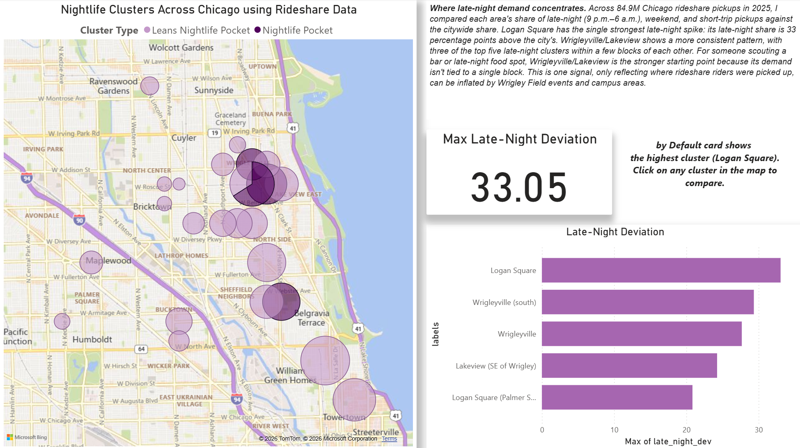

# Where Does Chicago Go Out at Night?
A look at 2025 rideshare data to find which parts of the city actually come alive late at night.

## The question
Say you're opening a bar or a late-night food spot. Before signing a lease, you'd
want some proof that people are actually out in that neighborhood after midnight.
That's what I tried to answer here: which areas of Chicago look like nightlife
areas, and which ones are just busy during commuting hours?

## What I found
- **Wrigleyville/Lakeview is the most consistent late-night area.** Three of the
  top five clusters sit within a few blocks of each other.
- **Logan Square has the biggest single spike.** Its share of late-night pickups
  runs 33 percentage points higher than the city's.
- **River North has the most trips of any nightlife area, but doesn't crack the
  top five.** It's busy around the clock, so late night is a smaller slice of
  its total.
- **Wicker Park shows up, but only in the second tier.** I expected it to rank
  higher. It lands in "Leans Nightlife Pocket," which I think is the same
  all-day-traffic effect as River North.
- Out of 659 areas, only 4 looked strongly like nightlife pockets and 21 leaned
  that way. Most of the city (494 areas) reads as commuter territory.

## Recommendation
Across the 84.9 million Chicago rideshare pickups in 2025, I compared each area's
share of late-night (9 p.m. to 6 a.m.), weekend, and short-trip pickups against
the citywide share. Logan Square has the strongest single late-night spike, at 33
percentage points above the city's share. Wrigleyville/Lakeview is more consistent,
with three of the top five late-night clusters within a few blocks of each other.
For an operator scouting a bar or late-night food spot, Wrigleyville/Lakeview is
the safer starting point, since its demand isn't riding on one block. This is only
one signal, though. It only shows where rideshare riders got picked up, and it can
be inflated by Wrigley Field events and campus areas.

## The data
- **Source:** City of Chicago Data Portal, Transportation Network Providers – Trips
- **Scope:** 93,514,416 trips in 2025. Of those, 84,864,755 (90.8%) had pickup
  coordinates, and those are the ones I analyzed. No sampling.
- **What each row represents:** a grid cell made by rounding pickup coordinates.
  I kept the 659 cells with at least 7,607 trips.

## How I did it
1. **SQL (BigQuery).** Tagged every trip by time of day, weekend or weekday, and
   distance. Then, for each grid cell, I worked out what share of its trips were
   late-night, weekend, and short, and subtracted the citywide share. That
   difference is the cell's "deviation."
2. **Python (pandas, in Colab).** Gave each cell a "signature" using the
   thresholds below, grouped nearby cells into roughly 400m clusters, and checked
   whether any cluster ended up holding cells with conflicting signatures.
3. **Power BI.** Built a map of the nightlife clusters, a bar chart of the top
   five by late-night deviation, and a card showing the highest deviation and
   where it is.

**Signature rules** (checked in order, first match wins):

| Signature | Late-night dev | Weekend dev | Short-trip dev |
|---|---|---|---|
| Nightlife Pocket | > 20 | > 15 | > 0 |
| Leans Nightlife Pocket | > 10 | > 8 | > −5 |
| Commuter Zone | < 0 | < 0 | < 0 |
| Leans Commuter Zone | ≤ 10 | ≤ 8 | < 5 |
| Mixed/Other | everything else | | |

*Late night = 9 p.m. to 6 a.m. Weekend = Saturday and Sunday.*

## Decisions I had to make along the way
- **Why coordinates instead of census tracts.** Census tract was only filled in
  for 62.5% of 2025 trips, since the city suppresses it for privacy. Pickup
  coordinates were there 90.8% of the time. Going with tracts would have thrown
  away a big chunk of trips, and not a random chunk, so I rounded the coordinates
  into grid cells instead.
- **Where the distance cutoffs came from.** 1.9 and 8.4 miles are the 25th and
  75th percentiles of trip distance, pulled with `APPROX_QUANTILES`. I used
  percentiles rather than picking round numbers myself because the data has some
  wild outliers (the longest "trip" in the table is over 1,000 miles), and
  percentiles don't get dragged around by those.
- **Why a minimum of 7,607 trips.** That's the 25th percentile of trips per cell.
  Cells with very few trips give unstable percentages. When I raised the cutoff to
  the median as a sanity check, none of the top 10 cells changed. (One note: when
  I reran this later, `APPROX_QUANTILES` returned 7,713 instead. It's an
  approximation, so the number moves slightly. The analysis uses 7,607.)
- **Why ~400m clusters.** Rounding to 2 decimals (about 1.1 km) lumped too much
  together and produced 74 clusters with conflicting signatures inside them, so I
  went smaller. A 500m grid and a ~400m grid each came out with 9 conflicts, but
  the 500m version had one cluster mixing opposite ends of the scale, while every
  400m conflict was between neighboring categories. So I went with ~400m, which in
  practice means 0.004° steps: about 445m north-south and 330m east-west at
  Chicago's latitude. This part took the longest, since I had to learn how
  coordinate data actually works.
- **A cell I caught by checking the map.** One high-ranking South Loop/Chinatown
  cell has its center point sitting under a highway. I checked it manually and
  flagged it. There are probably others I didn't catch, since I only spot-checked
  the top cells.

## What this doesn't tell you
- **It's pickups only.** A late-night pickup could be someone leaving a bar, or
  someone leaving home to go out, or someone heading to a second bar. That means a
  residential area full of young people can score high, and it might be inflating
  Logan Square's number.
- **My late-night window is wide.** 9 p.m. to 6 a.m. includes 4 and 5 a.m., which
  is probably airport runs and early shifts, not nightlife.
- **It measures share, not volume.** A cell's score is the *fraction* of its trips
  that happen late at night, not how many. Places that are packed all day get
  underrated (see River North and Wicker Park).
- **Grid lines cut through real places.** One bar strip can get split across a few
  cells, which waters down each one.
- **Things I know are mixed in.** Wrigley Field events, and campus areas like
  Hyde Park and Lincoln Park where student activity looks a lot like nightlife.
- **It's one signal.** Rideshare riders only. No walkers, drivers, or CTA riders,
  and nothing about rent, competition, or licensing.

## What I'd do next (v2)
Partway through interpreting this, I realized one big window from 9 p.m. to 6 a.m.
can't tell "going out" apart from "going home." For a second version I'd:
1. Count both ends of every trip, using the trip end time for dropoffs.
2. Split late night into an early window (about 9 p.m. to midnight) and a late one
   (about midnight to 4 a.m.), which also drops the early-morning airport hours.
3. Define a nightlife area as one with lots of arrivals early *and* lots of
   departures late. A residential area shouldn't show both.
4. As a quicker first check, rerun this same query on dropoff locations and see
   whether the top areas hold up.
5. Dig into why Wicker Park and River North stay in the second tier. My guess is
   heavy daytime traffic diluting their late-night share, but I'd want to test
   that by ranking on late-night trip counts instead of share.
6. Add a column flagging which cells I've manually checked against a map.

## Files
| File | What it is |
|---|---|
| `bigq.sql` | All the BigQuery queries |
| `chi_tnp_proj.ipynb` | Python notebook: signatures and clustering |
| `final_clustered_output.csv` | Final labeled and clustered output (659 cells) |
| `tnp_cluster_viz_prerec.pbix` | Power BI dashboard (needs Power BI Desktop) |
| `Dashboard.png` | Screenshot of the dashboard |

## Tools
BigQuery (SQL) · Python/pandas (Google Colab) · Power BI Desktop